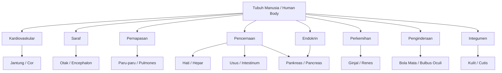
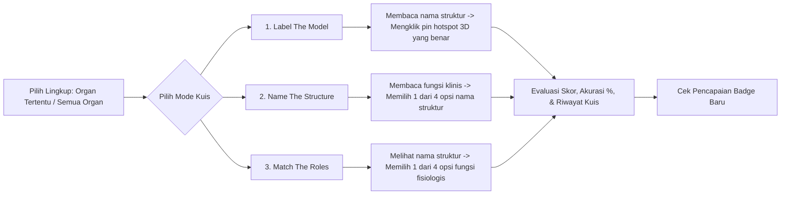

# Dokumentasi Fungsional (Functional Documentation) — Anatomy Atelier (AuriSphere Pro)

## 1. Ikhtisar Fungsional Platform

**Anatomy Atelier** dirancang sebagai atlas anatomi 3D komprehensif untuk mahasiswa kedokteran, tenaga kesehatan, dan pendidik biologi. Platform ini menyediakan 9 spesimen organ 3D resolusi tinggi dengan akurasi klinis, 62 struktur anatomi berstandar **Terminologia Anatomica (TA2)**, modul pembelajaran mandiri, sistem kuis adaptif, alat visualisasi bedah/radiologi interaktif, dan pelacakan progres belajar lokal.

---

## 2. Cakupan Spesimen & Sistem Tubuh Manusia

Aplikasi memetakan **9 Spesimen Organ Utama** ke dalam **8 Sistem Tubuh Manusia**:

### Tabel Spesimen Organ & Metrik Fisiologis

| ID Organ | Nama Organ | Nama Ilmiah / TA2 | Sistem Terkait | Dimensi Nyata (`realSizeMm`) | Jumlah Hotspot | Metrik Fisiologis Klinis |
| :--- | :--- | :--- | :--- | :--- | :--- | :--- |
| `heart` | Jantung | *Cor* | Kardiovaskular | 120 mm | 9 | Denyut Istirahat (60-100 bpm), Cardiac Output (~5.0 L/min), Tekanan Sistolik (~120 mmHg) |
| `brain` | Otak | *Encephalon* | Saraf | 170 mm | 8 | Berat Organ (~1400 g), Konsumsi Oksigen (~20%), Jumlah Neuron (~86 Miliar) |
| `lungs` | Paru-paru | *Pulmones* | Pernapasan | 240 mm | 7 | Kapasitas Vital (~4.8 L), Laju Pernapasan (12-20 bpm), Area Pertukaran Alveolar (~70 m²) |
| `liver` | Hati | *Hepar* | Pencernaan | 220 mm | 6 | Aliran Darah Portal (~1.5 L/min), Berat Organ (~1.5 kg), Kapasitas Regenerasi |
| `kidneys` | Ginjal | *Renes* | Perkemihan | 110 mm | 7 | GFR Laju Filtrasi (~125 mL/min), Aliran Darah Renal (20-25%), Produksi Urin (~1.5 L/hari) |
| `eyeball` | Bola Mata | *Bulbus Oculi* | Penginderaan | 24 mm | 8 | Diameter Aksial (~24 mm), Tekanan Intraokular (10-21 mmHg), Daya Pembiasan Kornea (~43 D) |
| `intestine` | Usus | *Intestinum* | Pencernaan | 280 mm | 7 | Panjang Usus Halus (~6 m), Panjang Kolon (~1.5 m), Waktu Transit (~24-72 jam) |
| `pancreas` | Pankreas | *Pancreas* | Endokrin / Cerna | 150 mm | 5 | Sekresi Eksokrin (~1.5 L/hari), Produksi Insulin Basal (~1 U/jam), Panjang Organ (~15 cm) |
| `skin` | Kulit | *Cutis* | Integumen | 50 mm (blok) | 5 | Luas Permukaan Total (~1.8 m²), Ketebalan Rata-rata (~2 mm), Berat Total (~4 kg) |

---

## 3. Fitur Panggung 3D Interaktif (*Interactive 3D Specimen Stage*)

### 3.1. Navigasi & Kontrol Kamera Presisi
- **Orbit 3D Bebas**: Klik & seret mouse atau usapan layar sentuh untuk memutar organ ke segala sudut.
- **Zooming**: Scroll mouse wheel atau gerakan mencubit layar (pinch-to-zoom).
- **Preset Stasiun Kamera Anatomi**:
  - *Anterior* (Tampak Depan)
  - *Posterior* (Tampak Belakang)
  - *Sinister / Left* (Tampak Kiri)
  - *Dexter / Right* (Tampak Kanan)
  - *Superior* (Tampak Atas)
  - *Inferior* (Tampak Bawah)
- **Fokus Cerdas Hotspot**: Memilih struktur anatomi akan mengarahkan kamera secara mulus (*smooth tween*) sejajar dengan vektor normal struktur tersebut.

### 3.2. Alat Visualisasi Medis & Bedah (*Medical Visualization Tools*)
1. **Cross-Section (Pemotongan Bidang Tiga Dimensi)**:
   - Memotong organ secara *real-time* berdasarkan bidang anatomi standar:
     - **Sagital**: Membagi kanan dan kiri.
     - **Transversal / Aksial**: Membagi atas dan bawah.
     - **Koronal / Frontal**: Membagi depan dan belakang.
   - Dilengkapi *Depth Slider* untuk kedalaman irisan dan tombol *Flip Direction* untuk membalik sudut potong.
2. **Mode X-Ray**:
   - Menghasilkan visualisasi tembus pandang dengan *depth prepass* bebas distorsi untuk melihat struktur internal tanpa menghilangkan batas tepi organ.
3. **Mode Isolate (Pemisahan Struktur)**:
   - Meredupkan bagian organ lainnya dan menyorot struktur tertentu yang sedang diinvestigasi.
4. **Mode Wireframe**:
   - Menampilkan struktur kisi geometris 3D mesh organ untuk evaluasi topologi.
5. **Alat Ukur Jarak Nyata (Measurement Tool)**:
   - Mengklik dua titik pada permukaan model 3D akan memproyeksikan garis ukur laser dan menghitung jarak anatomis dalam skala **milimeter (mm)** asli.
6. **In-Scene Label Sprites**:
   - Menyematkan nama-nama struktur anatomi langsung pada model 3D yang dapat diaktifkan secara permanen.
7. **Tangkapan Layar Berkualitas Tinggi (Capture Viewport)**:
   - Menghasilkan tangkapan layar instan format PNG beresolusi tinggi tanpa elemen HUD/antarmuka untuk keperluan tugas, presentasi, atau bahan ajar.

---

## 4. Modul Pembelajaran & Kuis Interaktif

### 4.1. Modul Belajar Terpandu (Guided Lessons)
- **Pembangkitan Otomatis Berbobot**: Struktur disusun berdasarkan tingkat urgensi belajar (`weight`), membimbing pengguna dari struktur fundamental menuju struktur lanjutan.
- **Grand Tour**: Modul pembelajaran lintas organ yang merangkum struktur utama dari seluruh tubuh manusia.
- **Autoplay & Audio Narasi**: Memandu pengguna langkah demi langkah secara otomatis dengan durasi transisi ideal (6.2 detik per struktur).

### 4.2. Engine Kuis Adaptif (3 Mode Ujian)
Pengguna dapat memilih ruang lingkup kuis: **Satu Organ Tertentu** atau **Seluruh Organ Tubuh**.

- **Algoritma Distraktor Cerdas**: Opsi jawaban salah (*distractors*) diprioritaskan dari organ yang sama agar relevan dan menguji pemahaman pengguna secara mendalam sebelum mengambil opsi dari organ lain.

---

## 5. Pelacakan Progres & Gamifikasi (Zero-Knowledge Privacy)

Semua data progres tersimpan 100% di browser pengguna:

### 5.1. Indikator Kemahiran (*Mastery Score*)
- Menghitung persentase penguasaan struktur organ secara individu dan persentase penguasaan tubuh total (0 - 100%).
- Struktur dapat ditandai manual sebagai "Sudah Dipelajari" (*Learned*).

### 5.2. Sistem 10 Lencana Pencapaian (*Achievement Badges*)
1. 🎖️ **First Specimen**: Membuka spesimen organ pertama.
2. 🏆 **All Specimens**: Membuka dan mengeksplorasi seluruh 9 spesimen organ.
3. 📝 **First Quiz**: Menyelesaikan sesi kuis pertama.
4. 🌟 **Perfect Quiz**: Meraih nilai sempurna (100%) pada sesi kuis.
5. 🎓 **First Lesson**: Menyelesaikan satu modul pelajaran terpandu.
6. ✍️ **Note Taker**: Menulis catatan studi pada minimal 3 spesimen organ.
7. 📌 **Curator**: Menyimpan 5 organ ke dalam daftar Bookmark.
8. 🥉 **Half Mastery**: Menguasai 50% dari total struktur anatomi tubuh.
9. 🥇 **Full Mastery**: Menguasai 100% seluruh 62 struktur anatomi tubuh.
10. 🔥 **Streak Three**: Membuka dan belajar selama 3 hari berturut-turut.

### 5.3. Catatan Medis & Ekspor Markdown
- Editor catatan terintegrasi pada setiap organ.
- Fitur ekspor satu klik seluruh catatan studi ke file **Markdown (`.md`)**.

---

## 6. Fitur Pendukung Tingkat Lanjut

### 6.1. Mode Komparasi Ganda (Side-by-Side Dual View)
- Menampilkan dua viewport 3D secara berdampingan (misal: Jantung vs Paru-paru atau Otak vs Mata).
- Sinkronisasi sudut pandang stasiun kamera untuk analisis perbandingan hubungan spasial.

### 6.2. Universal Command Palette (`Ctrl+K` / `⌘K`)
- Pencarian instan untuk melompat langsung ke spesimen organ, struktur anatomi, sistem tubuh, modul pelajaran, atau menjalankan aksi cepat (seperti beralih tema, membuka kuis, dan ekspor catatan).

### 6.3. Lembar Cetak Studi (Print Study Sheet)
- Antarmuka cetak yang dioptimalkan untuk kertas fisik atau file PDF yang merangkum fakta organ, tabel struktur lengkap dengan istilah TA2, kondisi patologis terkait, serta catatan pribadi pengguna.

### 6.4. Deep Linking URL State
- Mendukung pemuatan kondisi aplikasi secara instan melalui parameter URL:
  - `?o=heart`: Membuka organ jantung.
  - `?h=aorta`: Langsung memfokuskan struktur aorta.
  - `?v=posterior`: Memposisikan kamera pada sudut belakang.
  - Contoh gabungan: `https://anatomy.vijeron.com/id?o=heart&h=aorta&v=posterior`
