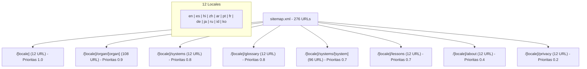

# Dokumentasi Sitemap XML (Sitemap & SEO Architecture) — Anatomy Atelier

## 1. Ikhtisar Arsitektur Sitemap XML

Sitemap XML pada **Anatomy Atelier** dirancang khusus untuk memastikan mesin pencari (*Google, Bing, Yandex, DuckDuckGo*) dapat merayapi (*crawl*) dan mengindeks seluruh 276 halaman multi-bahasa dengan tepat tanpa masalah duplikasi konten (*duplicate content penalty*).

File fisik sitemap terletak di:
`file:///c:/ai/human-body/public/sitemap.xml` dan dapat diakses publik pada `https://anatomy.vijeron.com/sitemap.xml`.

---

## 2. Struktur Matriks 276 Halaman Terindeks

Sitemap memetakan **23 template rute unik** yang direplikasi ke dalam **12 bahasa terjemahan resmi**, menghasilkan total **276 URL statis indexable**:



### Tabel Rincian Rute, Prioritas, & Frekuensi Perubahan

| Kategori Rute | Pola URL | Jumlah URL | Prioritas (`priority`) | Frekuensi (`changefreq`) | Keterangan Konten |
| :--- | :--- | :---: | :---: | :---: | :--- |
| **Studio 3D Utama** | `/[locale]` | 12 | `1.0` | `weekly` | Panggung 3D interaktif utama & indeks navigasi lengkap |
| **Artikel Organ** | `/[locale]/organ/[organ]` | 108 | `0.9` | `monthly` | 9 Spesimen organ (jantung, otak, paru, dll.) x 12 bahasa |
| **Hub Glosarium** | `/[locale]/glossary` | 12 | `0.8` | `monthly` | 62 struktur anatomi lengkap dengan istilah TA2 (A-Z) |
| **Hub Sistem Tubuh** | `/[locale]/systems` | 12 | `0.8` | `monthly` | Ringkasan 8 sistem biologis utama manusia |
| **Detail Sistem** | `/[locale]/systems/[system]` | 96 | `0.7` | `monthly` | 8 Halaman sistem tubuh x 12 bahasa |
| **Hub Pelajaran** | `/[locale]/lessons` | 12 | `0.7` | `monthly` | Indeks seluruh kurikulum & langkah belajar anatomi |
| **Tentang / Metodologi** | `/[locale]/about` | 12 | `0.4` | `yearly` | Referensi ilmiah, standar TA2, dan batasan medis |
| **Kebijakan Privasi** | `/[locale]/privacy` | 12 | `0.2` | `yearly` | Kebijakan penyimpanan data lokal tanpa pelacakan |
| **TOTAL KESELURUHAN** | | **276** | | | **Semua halaman mendukung canonical & 13 rel alternates** |

---

## 3. Implementasi Multi-bahasa `xhtml:link` & `hreflang`

Setiap entri URL di dalam `sitemap.xml` menyertakan **13 tag relasi bahasa bergantian (*alternate links*)**:
- 12 tag untuk masing-masing kode bahasa ISO/BCP-47 (`en, es, hi, zh, ar, pt, fr, de, ja, ru, id, ko`).
- 1 tag `x-default` yang mengarah ke versi bahasa Inggris (`en`) sebagai rujukan default pengguna global.

### Mengapa Ini Sangat Penting?
Mesin pencari seperti Google memerlukan sinyal eksplisit dua arah (*bidirectional signals*) antara head tag HTML (`<link rel="alternate" hreflang="...">`) dan entri `sitemap.xml`. Ini mencegah Google menganggap halaman versi Spanyol atau Indonesia sebagai terjemahan duplikat dari versi Inggris.

---

## 4. Contoh Struktur Cuplikan XML (`sitemap.xml`)

Berikut adalah contoh nyata representasi XML untuk rute studio dan rute artikel spesimen organ:

```xml
<?xml version="1.0" encoding="UTF-8"?>
<urlset xmlns="http://www.sitemaps.org/schemas/sitemap/0.9" xmlns:xhtml="http://www.w3.org/1999/xhtml">
  <!-- Contoh 1: Halaman Utama Versi Bahasa Indonesia -->
  <url>
    <loc>https://anatomy.vijeron.com/id</loc>
    <lastmod>2026-08-18</lastmod>
    <changefreq>weekly</changefreq>
    <priority>1.0</priority>
    <xhtml:link rel="alternate" hreflang="en" href="https://anatomy.vijeron.com/en"/>
    <xhtml:link rel="alternate" hreflang="es" href="https://anatomy.vijeron.com/es"/>
    <xhtml:link rel="alternate" hreflang="hi" href="https://anatomy.vijeron.com/hi"/>
    <xhtml:link rel="alternate" hreflang="zh" href="https://anatomy.vijeron.com/zh"/>
    <xhtml:link rel="alternate" hreflang="ar" href="https://anatomy.vijeron.com/ar"/>
    <xhtml:link rel="alternate" hreflang="pt" href="https://anatomy.vijeron.com/pt"/>
    <xhtml:link rel="alternate" hreflang="fr" href="https://anatomy.vijeron.com/fr"/>
    <xhtml:link rel="alternate" hreflang="de" href="https://anatomy.vijeron.com/de"/>
    <xhtml:link rel="alternate" hreflang="ja" href="https://anatomy.vijeron.com/ja"/>
    <xhtml:link rel="alternate" hreflang="ru" href="https://anatomy.vijeron.com/ru"/>
    <xhtml:link rel="alternate" hreflang="id" href="https://anatomy.vijeron.com/id"/>
    <xhtml:link rel="alternate" hreflang="ko" href="https://anatomy.vijeron.com/ko"/>
    <xhtml:link rel="alternate" hreflang="x-default" href="https://anatomy.vijeron.com/en"/>
  </url>

  <!-- Contoh 2: Artikel Spesimen Jantung Versi Bahasa Indonesia -->
  <url>
    <loc>https://anatomy.vijeron.com/id/organ/heart</loc>
    <lastmod>2026-08-18</lastmod>
    <changefreq>monthly</changefreq>
    <priority>0.9</priority>
    <xhtml:link rel="alternate" hreflang="en" href="https://anatomy.vijeron.com/en/organ/heart"/>
    <xhtml:link rel="alternate" hreflang="es" href="https://anatomy.vijeron.com/es/organ/heart"/>
    <xhtml:link rel="alternate" hreflang="hi" href="https://anatomy.vijeron.com/hi/organ/heart"/>
    <xhtml:link rel="alternate" hreflang="zh" href="https://anatomy.vijeron.com/zh/organ/heart"/>
    <xhtml:link rel="alternate" hreflang="ar" href="https://anatomy.vijeron.com/ar/organ/heart"/>
    <xhtml:link rel="alternate" hreflang="pt" href="https://anatomy.vijeron.com/pt/organ/heart"/>
    <xhtml:link rel="alternate" hreflang="fr" href="https://anatomy.vijeron.com/fr/organ/heart"/>
    <xhtml:link rel="alternate" hreflang="de" href="https://anatomy.vijeron.com/de/organ/heart"/>
    <xhtml:link rel="alternate" hreflang="ja" href="https://anatomy.vijeron.com/ja/organ/heart"/>
    <xhtml:link rel="alternate" hreflang="ru" href="https://anatomy.vijeron.com/ru/organ/heart"/>
    <xhtml:link rel="alternate" hreflang="id" href="https://anatomy.vijeron.com/id/organ/heart"/>
    <xhtml:link rel="alternate" hreflang="ko" href="https://anatomy.vijeron.com/ko/organ/heart"/>
    <xhtml:link rel="alternate" hreflang="x-default" href="https://anatomy.vijeron.com/en/organ/heart"/>
  </url>
</urlset>
```

---

## 5. Logika Pembangkitan Otomatis (*Generation Pipeline*)

### Mengapa Dihasilkan Saat Build Time (Bukan Route Handler)?
Pada lingkungan ekspor statis Vinext/Next.js (`output: 'export'`), seluruh `route.ts` API dilewati saat proses build. Oleh karena itu, sitemap dibangun secara deterministik oleh skrip pra-build:

1. **`app/lib/static-files.ts`**:
   Mendefinisikan fungsi murni `sitemapXml()` yang membaca daftar spesimen `organIds`, `systemIds`, dan konfigurasi bahasa `locales`.
2. **`scripts/generate-static-files.mjs`**:
   Mengeksekusi fungsi tersebut sebelum `vinext build` berjalan dan menulis hasilnya langsung ke `public/sitemap.xml` (berukuran ~407 KB).
3. **Penyaringan Lingkungan Non-Produksi**:
   Jika variabel lingkungan `NEXT_PUBLIC_ALLOW_INDEXING=false` (misal pada server pengujian / *staging*), fungsi `sitemapXml()` akan mengembalikan `null` dan menghapus sitemap untuk mencegah pengindeksan URL uji coba oleh Google.

---

## 6. Hubungan dengan `robots.txt` & Skema Terstruktur JSON-LD

Sitemap didaftarkan secara eksplisit di baris terakhir `public/robots.txt`:
```txt
User-agent: *
Allow: /

Disallow: /*?*authoring=

Sitemap: https://anatomy.vijeron.com/sitemap.xml
```

Selain sitemap XML, seluruh 276 halaman menyematkan skema terstruktur **Schema.org JSON-LD**:
- **Halaman Studio**: Tipe `WebApplication`, `WebSite`, `Organization`.
- **Halaman Artikel Organ**: Tipe `MedicalWebPage` membungkus `AnatomicalStructure` (dengan properti `partOfSystem`, `relatedCondition`, dan `subStructure`).
- **Halaman Sistem**: Tipe `AnatomicalSystem`.
- **Halaman Hub & Glosarium**: Tipe `CollectionPage` dan `ItemList`.
- **Navigasi Seluruh Halaman**: Tipe `BreadcrumbList`.

---

## 7. Cara Memperbarui atau Membangun Ulang Sitemap

Untuk memperbarui sitemap setelah menambah organ baru, mengubah domain, atau memperbarui tanggal tinjauan medis:

```bash
# Menjalankan generasi file SEO saja:
npm run seo:generate

# Menjalankan build lengkap dan uji verifikasi:
npm run build
```
