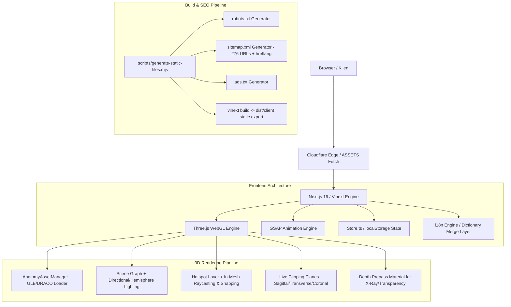

# Dokumentasi Teknis (Technical Documentation) — Anatomy Atelier (AuriSphere Pro)

## 1. Ikhtisar Arsitektur Sistem (System Architecture Overview)

**Anatomy Atelier** adalah platform edukasi anatomi 3D interaktif berbasis web yang menggabungkan rendering grafis 3D performa tinggi via WebGL/Three.js, antarmuka pengguna responsif Next.js 16 (React 19), sistem lokalisasi multi-bahasa (12 bahasa termasuk RTL), dan arsitektur ekspor statis (*Static Site Generation*) yang dioptimalkan untuk Cloudflare Workers Edge Network.



---

## 2. Tumpukan Teknologi (Technology Stack)

| Kategori | Teknologi / Library | Versi | Peran & Justifikasi |
| :--- | :--- | :--- | :--- |
| **Framework Inti** | `next` | `16.2.6` | App Router, Server Components untuk SEO, static generation |
| **Runtime & Bundler** | `vinext` + `vite` | `0.0.50` / `8.0.13` | Next.js runtime adapter untuk Cloudflare Workers |
| **UI Library** | `react` / `react-dom` | `19.2.6` | Modern Concurrent Mode, `useSyncExternalStore`, React Server Components |
| **3D WebGL Engine** | `three` | `^0.185.1` | Rendering 3D mesh, shaders, lighting, shadows, raycasting |
| **Animasi & Transisi** | `gsap` | `^3.15.0` | Interpolasi perpindahan kamera (smooth tweening), transisi HUD & timeline |
| **Styling & CSS** | `tailwindcss` | `4.2.1` | Utility-first CSS v4 dengan modul CSS murni |
| **Ikonografi** | `lucide-react` | `^1.28.0` | Ikon UI vektor SVG seragam & ringan |
| **Hosting & Edge** | `@cloudflare/vite-plugin`, `wrangler` | `4.92.0` | Hosting static export pada Cloudflare Workers Free Tier |
| **Data Layer (Opsional)**| `drizzle-orm` | `0.45.2` | Skema database D1 jika fitur cloud diaktifkan di masa depan |
| **Testing & Tooling** | `tsx` + Node test runner | `4.22.1` | Pengujian invarian data anatomi, SEO tags, & validasi render HTML |

---

## 3. Struktur Direktori Proyek (Directory Tree)

```
c:\ai\human-body\
├── app/
│   ├── [locale]/                      # Dynamic locale routing ([en, es, id, de, ...])
│   │   ├── about/page.tsx             # Halaman Metodologi & Batasan Klinis
│   │   ├── glossary/page.tsx          # Glosarium Istilah TA2 (A-Z)
│   │   ├── lessons/page.tsx           # Hub Pembelajaran Interaktif
│   │   ├── organ/[organ]/page.tsx     # Artikel Spesimen Organ & Data Fisiologis
│   │   ├── privacy/page.tsx           # Kebijakan Privasi & Penyimpanan Data
│   │   ├── systems/                   # Hub Sistem Tubuh
│   │   │   ├── page.tsx               # Ringkasan 8 Sistem Utama
│   │   │   └── [system]/page.tsx      # Detail Sistem & Organ Terkait
│   │   ├── layout.tsx                 # Root Layout per Bahasa (RTL/LTR, Font, Analytics)
│   │   └── page.tsx                   # Halaman Studio Utama 3D + Index SEO
│   ├── components/                    # Komponen Antarmuka (UI Components)
│   │   ├── AnatomyApp.tsx             # Orkestrator Status Studio Utama
│   │   ├── OrganViewer.tsx            # Wrapper React untuk WebGL Canvas Three.js
│   │   ├── Inspector.tsx              # Panel Analisis Anatomi & Editor Catatan
│   │   ├── SpecimenLibrary.tsx        # Galeri Pemilihan Organ & Hotspot
│   │   ├── CompareView.tsx            # Mode Komparasi Dual-Viewer 3D
│   │   ├── QuizSession.tsx            # Engine Kuis Interaktif (3 Mode)
│   │   ├── LessonPlayer.tsx           # Player Pembelajaran Otomatis & Step Narasi
│   │   ├── CommandPalette.tsx         # Quick Search (Ctrl+K / ⌘K)
│   │   ├── Overlays.tsx               # Modal Sheet (Glosarium, Sistem, Progres)
│   │   ├── TopBar.tsx                 # Bar Navigasi & Aksi Cepat
│   │   ├── Toasts.tsx                 # Notifikasi UI & Pencapaian Badge
│   │   └── primitives.tsx             # Komponen Dasar (MetricBar, Ring, OrganArt)
│   ├── i18n/                          # Engine Lokalisasi (12 Bahasa)
│   │   ├── config.ts                  # Konfigurasi Locale, Script Group, & Arah Teks
│   │   ├── dictionaries.ts            # Loader Kamus Terjemahan
│   │   ├── merge.ts                   # Layer Penggabungan Patch Bahasa di atas English
│   │   └── organs/                    # Data Deskripsi & Medis per Organ
│   ├── lib/                           # Core Logic & Utilities
│   │   ├── anatomy-data.ts            # Master Skema Data (ID, TA2, Koordinat, Metrik)
│   │   ├── content-meta.ts            # Metadata Verifikasi Medis & Review Date
│   │   ├── lessons.ts                 # Algoritma Pembangkit Modul Belajar
│   │   ├── quiz.ts                    # Algoritma Distraktor & Pembangkit Soal Kuis
│   │   ├── routes.ts                  # Resolusi URL Terpusat & Deep Linking
│   │   ├── seo.ts                     # Schema.org JSON-LD & OpenGraph Generator
│   │   ├── static-files.ts            # Pembangkit robots.txt, sitemap.xml, & ads.txt
│   │   ├── store.ts                   # Local Store (localStorage Sync External Store)
│   │   ├── url-state.ts               # Sinkronisasi Query Param URL
│   │   └── three/                     # Engine Grafis WebGL 3D
│   │       ├── viewer.ts              # Kelas Utama AnatomyViewer & Render Loop
│   │       ├── hotspots.ts            # In-Scene Pin Hotspot & Sprite Rendering
│   │       ├── loaders.ts             # Manajemen Cache Model GLB & DRACO Loader
│   │       └── dispose.ts             # Manajemen Pembersihan Memori GPU
│   └── styles/                        # Style Token & CSS Variables
├── public/                            # Aset Statis Publik
│   ├── anatomy/                       # Gambar Ilustrasi WebP Tiap Organ
│   ├── draco/                         # WebAssembly Decoder DRACO untuk Three.js
│   ├── models/                        # File 3D Mesh GLB Terkompresi
│   ├── robots.txt                     # File Kontrol Web Crawler
│   ├── sitemap.xml                    # Sitemap XML 276 Halaman + xhtml:link
│   └── ads.txt                        # Konfigurasi Monetisasi Iklan
├── scripts/                           # Script Otomasi Build & i18n
│   ├── generate-static-files.mjs      # Pembangkit File Statis Prebuild
│   ├── i18n-audit.mjs                 # Audit Kelengkapan Terjemahan
│   └── i18n-export.mjs                # Export Format JSON untuk TMS
├── tests/                             # Unit Test & Validasi SEO
│   ├── anatomy-data.test.mjs          # Uji Integritas Data Anatomi & Koordinat
│   ├── rendered-html.test.mjs         # Uji Render HTML Server Component
│   └── seo.test.mjs                   # Uji Validitas Tag Meta & hreflang
├── wrangler.jsonc                     # Konfigurasi Cloudflare Workers
└── next.config.ts                     # Konfigurasi Next.js (output: 'export')
```

---

## 4. Pipeline Grafis & Engine 3D (`app/lib/three/`)

Engine 3D dibangun secara imperatif di luar React component tree untuk menjamin performa 60 FPS konstan tanpa re-render yang tidak perlu:

### 4.1. Siklus Render Berbasis Kebutuhan (*Render on Demand*)
Renderer tidak menggunakan `requestAnimationFrame` tak terhingga jika scene dalam keadaan diam. Flag `dirty` dan timer `busyUntil` hanya memicu rendering ketika:
1. Pengguna sedang memutar/menggeser kamera (`OrbitControls` change event).
2. Tween kamera sedang berlangsung (`gsap.to`).
3. Animasi Auto-rotate aktif.
4. Hotspot sedang mengalami animasi denyut (*pulse/focus animation*).

### 4.2. Penanganan Shader & X-Ray Depth Prepass
Untuk menghasilkan visual organ tembus pandang (X-Ray) yang bersih tanpa artefak *z-fighting* atau permukaan organ yang tampak berantakan:
- Diterapkan material **Depth Prepass** (`depthWrite: true`, `colorWrite: false`).
- Lapisan mesh terluar menulis depth buffer terlebih dahulu, kemudian material semi-transparan digambar di atasnya.

### 4.3. Pemotongan Bidang Dinamis (*Live Cross-Section Clipping Planes*)
- Tiga sumbu standar anatomi:
  - **Sagittal (Sumbu X)**: Memotong tubuh menjadi bagian Kiri (*Sinister*) dan Kanan (*Dexter*).
  - **Transverse / Axial (Sumbu Y)**: Memotong tubuh menjadi bagian Atas (*Superior*) dan Bawah (*Inferior*).
  - **Coronal / Frontal (Sumbu Z)**: Memotong tubuh menjadi bagian Depan (*Anterior*) dan Belakang (*Posterior*).
- Dilengkapi fitur *Flip Plane Direction* dan slider kedalaman (*Depth Slider*).

### 4.4. Proyeksi Hotspot & Snapping Mesh
- Koordinat titik anotasi didefinisikan dalam format `[x, y, z]` relatif.
- Algoritma linear raycast melakukan snapping titik ke permukaan terluar (*mesh shell*), mencegah titik melayang di udara atau terbenam di dalam organ.
- Mode Authoring internal (`?authoring=1`) memungkinkan pencatatan koordinat titik baru langsung dari permukaan model.

### 4.5. Pengukuran Jarak Nyata (*Measurement Tool*)
- Pengguna memilih 2 titik pada mesh organ menggunakan raycasting.
- Jarak Euclidean 3D dalam unit model dihitung, lalu dikalikan dengan konstanta `realSizeMm` organ untuk menghasilkan estimasi dimensi anatomi nyata dalam satuan **milimeter (mm)**.

---

## 5. Manajemen State & Persistensi Data (`app/lib/store.ts`)

Aplikasi mengutamakan **Privasi Total Tanpa Server** (*Zero-Knowledge Client Storage*):
- Semua progres belajar disimpan secara lokal pada `window.localStorage` dengan key `anatomy-atelier:v2`.
- Menggunakan arsitektur `useSyncExternalStore` dari React 19 untuk mencegah masalah *hydration mismatch* antara server SSR dan browser klien.

### Struktur State (`StoreState`)
```typescript
export type Progress = {
  visited: OrganId[];        // Daftar organ yang pernah dibuka
  learned: string[];        // Format: "${organId}:${hotspotId}"
  bookmarks: OrganId[];      // Daftar organ favorit
  notes: Record<string, { text: string; updatedAt: number }>; // Catatan klinis
  quizzes: { 
    taken: number; 
    best: number; 
    correct: number; 
    answered: number 
  };
  lessonsDone: string[];    // ID pelajaran yang terselesaikan
  streak: { count: number; lastDay: string }; // Hari belajar berturut-turut
  achievements: string[];   // ID badge pencapaian yang diperoleh
};

export type Prefs = {
  theme: "light" | "dark" | "system";
  reduceMotion: boolean;
  quality: "auto" | "high" | "low";
  alwaysLabels: boolean;
  textSize: "sm" | "md" | "lg";
};
```

---

## 6. Sistem Lokalisasi (i18n Localization Engine)

Sistem lokalisasi mendukung **12 bahasa**:
1. `en` (English - US)
2. `es` (Español)
3. `hi` (हिन्दी - Hindi)
4. `zh` (中文 - Simplified Chinese)
5. `ar` (العربية - Arabic, RTL)
6. `pt` (Português - Brazil)
7. `fr` (Français)
8. `de` (Deutsch)
9. `ja` (日本語 - Japanese)
10. `ru` (Русский - Russian)
11. `id` (Bahasa Indonesia)
12. `ko` (한국어 - Korean)

### Mekanisme Penggabungan Kamus (*Fallback Patching Layer*)
- Kamus bahasa Inggris (`en`) bertindak sebagai basis universal (*ground truth*).
- Bahasa lain mengimpor patch terjemahan parsial.
- Fungsi `deepMerge(enDictionary, localeDictionary)` memastikan antarmuka tidak akan pernah mengalami teks kosong jika suatu bahasa belum memiliki terjemahan untuk fitur baru.
- Kunci terminologi medis mengacu pada standar internasional **Terminologia Anatomica (TA2)**.

---

## 7. Arsitektur Build & Hosting Cloudflare Workers

Aplikasi diekspor sebagai situs statis murni (`output: 'export'` pada `next.config.ts`):
1. **Prebuild SEO Generation (`scripts/generate-static-files.mjs`)**:
   Mengekspor `robots.txt`, `sitemap.xml`, dan `ads.txt` ke direktori `public/`.
2. **Vinext Build**:
   Mengkompilasi seluruh 276 halaman HTML untuk 12 bahasa ke `dist/client/`.
3. **Cloudflare Edge Serving**:
   Aset statis dilayani langsung oleh Cloudflare Edge Cache tanpa menggunakan kuota CPU Worker gratis (100.000 request/hari).
4. **Worker Fallback (`worker/index.ts`)**:
   Menangani redirect root `/` ke `/${defaultLocale}` (`/en` atau `/id`) dan meneruskan request lainnya ke `env.ASSETS.fetch()`.

---

## 8. Panduan Menjalankan & Perintah Build

```bash
# Instalasi Dependensi
npm install

# Menjalankan Server Pengembangan Lokal
npm run dev

# Menjalankan Uji Data Anatomi & Integritas Unit
npm run test:unit

# Menjalankan Audit Kualitas Terjemahan Bahasa
npm run i18n:audit

# Membuat File SEO (robots.txt, sitemap.xml, ads.txt)
npm run seo:generate

# Build Penuh & Uji Render
npm test

# Deploy ke Cloudflare Workers
npm run deploy
```
